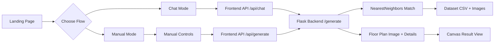

# VaastuGPT / Make My Home

VaastuGPT is a student project for AI-assisted floor plan suggestion. The app lets a user describe a home in natural language or fill in manual constraints like square footage, bedrooms, bathrooms, and garage count. The system then matches those inputs with a house plan from the dataset and returns a generated result image.

## Project Idea

The project is built like a small product demo:

1. A landing page introduces the idea.
2. The user chooses between Chat Mode and Manual Mode.
3. The frontend sends the layout requirements to the backend.
4. The backend searches the dataset using a nearest-neighbor model.
5. The closest matching house plan image is returned and shown on the canvas.

This makes the project easy to explain as a simple end-to-end architecture for AI-based architectural inspiration.

## Architecture



### Frontend

The frontend is a Next.js app located in `Frontend/`. It contains:

- A landing page with navigation to the two modes.
- Chat Mode for a conversational experience.
- Manual Mode for precise input controls.
- A result canvas that displays the returned floor plan.

Important frontend files:

- `Frontend/app/page.tsx` for the landing page.
- `Frontend/app/chat/page.tsx` for the chat-based flow.
- `Frontend/app/manual/page.tsx` for the manual flow.
- `Frontend/components/chatbot-panel.tsx` for message collection.
- `Frontend/components/input-panel.tsx` for slider and button-based inputs.
- `Frontend/app/api/generate/route.ts` for proxying generation requests to the Flask backend.

### Backend

The backend is a Flask application in `Backend/app.py`. It loads a CSV dataset, cleans the numeric columns, scales the features, and uses `NearestNeighbors` from scikit-learn to find the closest house plan.

Main backend responsibilities:

- Load the dataset from `Backend/dataset/house_plans_details.csv`.
- Normalize the required fields.
- Compare the user request against the dataset.
- Return the closest matching image and the selected plan details.

### Data Flow

The request flow is simple:

1. The user enters requirements in Chat Mode or Manual Mode.
2. The frontend builds a payload with `sq_ft`, `bedrooms`, `bathrooms`, and `garage`.
3. The payload is sent to the backend `/generate` endpoint.
4. The backend runs the nearest-neighbor search on the dataset.
5. The matching floor plan image is returned as `image_url`.
6. The frontend renders the image in the main canvas.

## Folder Structure

```text
VaastuGPT/
├── Backend/
│   ├── app.py
│   └── dataset/
│       ├── house_plans_details.csv
│       └── images/
└── Frontend/
    ├── app/
    │   ├── page.tsx
    │   ├── chat/
    │   ├── manual/
    │   └── api/
    ├── components/
    ├── hooks/
    └── lib/
```

## Tech Stack

- Frontend: Next.js, React, TypeScript, Tailwind CSS, Framer Motion.
- Backend: Flask, pandas, NumPy, scikit-learn, Flask-CORS.
- Dataset: CSV-based house plan metadata plus image files.

## How It Works

### Chat Mode

The chat panel collects natural language input and sends it to the AI chat layer. Once the request is complete, the app converts the conversation into structured layout requirements and forwards them for generation.

### Manual Mode

The manual panel gives direct control over the input values. This is useful when the user already knows the target dimensions and wants a more predictable output.

### Generation Engine

The backend does not invent a plan from scratch. Instead, it behaves like a recommendation engine:

- It reads the user constraints.
- It scales the feature vector.
- It searches for the closest row in the dataset.
- It returns the matching house plan image.

This is a practical approach for a student project because it is easier to explain, easier to debug, and works well with a curated dataset.

## Setup

### 1. Start the backend

```bash
cd Backend
python app.py
```

The Flask server runs on port `5001`.

### 2. Start the frontend

```bash
cd Frontend
pnpm install
pnpm dev
```

The frontend runs on the default Next.js port.

### 3. Optional environment variable

If you want the frontend proxy to point to a different backend host, set:

```bash
BACKEND_URL=http://127.0.0.1:5001
```

## API Endpoints

### `POST /generate`

Accepts a JSON body with:

- `sq_ft`
- `bedrooms`
- `bathrooms`
- `garage`

Returns:

- `image_url`
- `details`

### `GET /image/<filename>`

Serves the matched floor plan image from the dataset folder.

## Notes For Demo Presentation

If you are presenting this project as a student demo, the main points to say are:

- This is a full-stack AI architecture demo.
- The frontend has two ways to collect user requirements.
- The backend uses a recommendation-style ML model.
- The result is matched from real dataset entries rather than generated from zero.
- The project shows the full flow from input to visual output.

## Future Improvements

- Add richer chat-to-structured-data extraction.
- Add download/export support for the generated plan.
- Add filtering by land size, budget, and style.
- Add a stronger ranking model for better matches.
- Show multiple candidate plans instead of only one result.

## Short Summary

VaastuGPT is a simple but complete architecture demo for AI-assisted house planning. It combines a modern Next.js frontend with a Flask + scikit-learn backend to turn user requirements into a matched floor plan image.